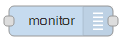
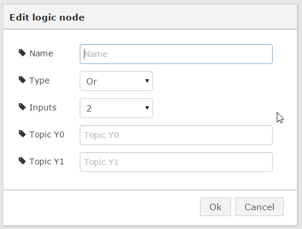

## node-red-picubes
   

Node.js module for Pi-Cubes Node-RED SDK.
Pi Cubes is Modular DIY/Hobby HVAC Automation system based on the Raspberry Pi. 
Supports up to 24 I/Os and 4 Thermostats.

More information: [www.cube-controls.com/pi-cubes.html](http://www.cube-controls.com/pi-cubes.html)

## Installation

    $ npm install node-red-picubes

I2C has to be configured on Raspberry Pi :

[www.cube-controls.com/blog/how-to-enable-i2c-on-raspberry-pi](http://www.cube-controls.com/blog/how-to-enable-i2c-on-raspberry-pi)

## writeDO Node - Control Pi-Cubes DO4 Module

#### Usage

- Name - Node name that is used as topic in output message as well. 
- Module - Module address (1-6)
- Output - Output number (1-4)
- Node Input - Payload of incoming message is the value(0/1) that is send to DO4 module.
- Node Output - Output of the node is message with value as payload only topic of message is name of the node.

## writeUO Node - Control Pi-Cubes UO4 Module

#### Usage

- Name - Node name that is used as topic in output message as well.
- Module - Module address (1-6)
- Output - Output number (1-4)
- Type   - Universal output type:
	- Digital Output (0/12VDC)
	- Modulation (0-10VDC)
	- Digital output PWM with period in seconds.
- Node Input - Payload of incoming message is the value that is send to UO4 module.
	- 0/1 for Digital Output
	- 0-100 for Modulation/PWM Output
- Node Output - Output of the node is message with input value as payload only topic of message is name of the node.

## readUI Node - Read Pi-Cubes UI4 Module

#### Usage

- Name - Node name that is used as topic in output message as well.
- Module - Module address (1-6)
- Output - Output number (1-4)
- Type   - Universal input type:
	- Resistance (Return value 0-350000)
 	- Digital (Return value 0-1).
	- Voltage/Current (Return value 0-100%,represent 0-10V/0-20mA). 
 	- 10K Type II Thermistor (Return temperature value in Celsius or Fahrenheit).
	- Pulse Input (Return value is counter value).
- Scan time - Input scanning time is seconds.  
- Node Output - Output of the node is message with input value as payload and topic of message is name of the node.

## CTA Node - Read/Write to Pi-Cubes CTA Module

#### Usage

- Name - Node name that is used as topic in output message as well.
- Slave - Modbus slave address for CTA.
- Register - Holding register address.
- Scale - Scale applied to register value.
- Scan time - Scanning time is seconds to read register from Modbus.  
- Node Input - Payload of incoming message is the value that is written to the register
- Node Output - Output of the node is value read from register and topic of message is name of the node.

## Monitor Node - Message payload monitor 

#### Usage

- Name - Node name that is used as topic in output message as well.

Displays payload of incoming message as status and adds name as topic of message on the output.

## Constant Node - Constant injector. 

#### Usage

- Name - Node name that is used as topic in output message as well.
- Value - Value is send out as message payload.
- Repeat - Time period that output message is resend.

Injects value as payload of message and name as topic of message on the output.

## Math Node - Simple math functions 

#### Usage

- Name - Node name that is used as topic in output message as well.
- Function - Math function
- Inputs - Number of inputs to math node.
- Topic Y0..Y3 - Name of topic for each input to math node. 

Calculate simple math operation on up to four inputs.

### Flow example

	[{"id":"507c50ff.af83b","type":"constant","name":"Y0","value":"5","repeat":"5","x":427,	"y":599,"z":"a6eb50.ff5914b","wires":[["acc4bda.f533b4"]]},	{"id":"acc4bda.f533b4","type":"math","name":"","math":"Add","number":"2","topicY0":"Y0"	,"topicY1":"Y1","topicY2":"","topicY3":"","x":646,"y":620,"z":"a6eb50.ff5914b","wires":	[[]]},	{"id":"6d1b44af.92e4bc","type":"constant","name":"Y1","value":"3","repeat":"5","x":427,	"y":662,"z":"a6eb50.ff5914b","wires":[["acc4bda.f533b4"]]}] 

## Logic Node - Simple logic functions 

#### Usage

- Name - Node name that is used as topic in output message as well.
- Type - Type of logic function
- Inputs - Number of inputs to logic node.
- Topic Y0..Y3 - Name of topic for each input to logic node. 
- Topic X0 - Name of topic that is used as selector in multiplexer mode.

Execute simple logical operation on up to four inputs. Multiplexer function is using "X" topic input as 
selector which Y input will be selected as output.

### Flow example OR logic

	[{"id":"507c50ff.af83b","type":"constant","name":"Y0","value":"1","repeat":"5","x":427,"y":599,"z":"a6eb50.ff5914b","wires":[["6deade92.92152"]]},{"id":"6d1b44af.92e4bc","type":"constant","name":"Y1","value":"0","repeat":"5","x":427,"y":662,"z":"a6eb50.ff5914b","wires":[["6deade92.92152"]]},{"id":"6deade92.92152","type":"logic","name":"","operator":"Or","number":"2","topicX":"","topicY0":"Y0","topicY1":"Y1","topicY2":"","topicY3":"","x":689,"y":630,"z":"a6eb50.ff5914b","wires":[[]]}]

### Flow example MUX logic

	[{"id":"ad3ae325.52c52","type":"monitor","name":"Value","x":917,"y":628,"z":"a6eb50.ff5914b","wires":[[]]},{"id":"507c50ff.af83b","type":"constant","name":"Y0","value":"3","repeat":"5","x":427,"y":599,"z":"a6eb50.ff5914b","wires":[["6deade92.92152"]]},{"id":"6d1b44af.92e4bc","type":"constant","name":"Y1","value":"8","repeat":"5","x":427,"y":662,"z":"a6eb50.ff5914b","wires":[["6deade92.92152"]]},{"id":"6deade92.92152","type":"logic","name":"","operator":"Mux","number":"3","topicX":"X","topicY0":"Y0","topicY1":"Y1","topicY2":"Y2","topicY3":"","x":689,"y":630,"z":"a6eb50.ff5914b","wires":[["ad3ae325.52c52"]]},{"id":"2f9a25b.fd065da","type":"constant","name":"X","value":"1","repeat":"5","x":424,"y":544,"z":"a6eb50.ff5914b","wires":[["6deade92.92152"]]},{"id":"617b2836.9e84d8","type":"constant","name":"Y2","value":"5","repeat":"5","x":427,"y":724,"z":"a6eb50.ff5914b","wires":[["6deade92.92152"]]}]

## Compare Node - Compare functions 

#### Usage

- Name - Node name that is used as topic in output message as well.
- Operator - Operator of compare function.
- Topic Y0 - Name of first compare parameter input to node.
- Topic Y0 - Name of second compare parameter input to node. 
- Topic X  - Name of compare parameter input used with "Between" operator.

Execute simple compare operation on two inputs. Between operation is using "X" topic input as 
value that is compared with Y0 and Y1.

###Flow example 

	[{"id":"ad3ae325.52c52","type":"monitor","name":"Value","x":844,"y":636,"z":"a6eb50.ff5914b","wires":[[]]},{"id":"507c50ff.af83b","type":"constant","name":"Y0","value":"3","repeat":"5","x":427,"y":599,"z":"a6eb50.ff5914b","wires":[["85ab39bc.7a54c8"]]},{"id":"6d1b44af.92e4bc","type":"constant","name":"Y1","value":"8","repeat":"5","x":427,"y":662,"z":"a6eb50.ff5914b","wires":[["85ab39bc.7a54c8"]]},{"id":"85ab39bc.7a54c8","type":"compare","name":"","operator":"LT","topicX":"","topicY0":"Y0","topicY1":"Y1","x":624,"y":638,"z":"a6eb50.ff5914b","wires":[["ad3ae325.52c52"]]}]

## Hysteresis Node - Hysteresis logic function 

#### Usage

- Name - Node name that is used as topic in output message as well.
- Topic X - Name of control parameter in hysteresis function 
- Topic Y0 - Name of ON parameter in hysteresis function
- Topic Y1 - Name of OFF parameter in hysteresis function 

Execute hysteresis relay operation to provide ON/OFF function with hysteresis. 

###Flow example 

	[{"id":"ad3ae325.52c52","type":"monitor","name":"Value","x":892,"y":624,"z":"a6eb50.ff5914b","wires":[[]]},{"id":"544f192.fabb0e8","type":"constant","name":"","value":"1","repeat":"1","x":242,"y":429,"z":"a6eb50.ff5914b","wires":[["c6fd80dc.39028"]]},{"id":"507c50ff.af83b","type":"constant","name":"Y0","value":"15","repeat":"5","x":431,"y":590,"z":"a6eb50.ff5914b","wires":[["4c4b84cb.b3b47c"]]},{"id":"6d1b44af.92e4bc","type":"constant","name":"Y1","value":"10","repeat":"5","x":431,"y":653,"z":"a6eb50.ff5914b","wires":[["4c4b84cb.b3b47c"]]},{"id":"4c4b84cb.b3b47c","type":"hysteresis","name":"Relay","topicX":"X0","topicY0":"Y0","topicY1":"Y1","x":657,"y":627,"z":"a6eb50.ff5914b","wires":[["ad3ae325.52c52"]]},{"id":"6f00c7d4.90ff38","type":"monitor","name":"X0","x":433,"y":517,"z":"a6eb50.ff5914b","wires":[["4c4b84cb.b3b47c"]]},{"id":"c6fd80dc.39028","type":"function","name":"RampUpDown","func":"context.counter = context.counter || 0; \ncontext.down = context.down || 0; \n\nif (context.down == 1)\n{\n  context.counter--;\n  if (context.counter === 0) context.down = 0;\n} else\n{\n  context.counter++;\n  if (context.counter == 20) context.down = 1;\n}\n\nvar newMsg = { payload: context.counter };\nreturn newMsg;\n","outputs":1,"noerr":0,"x":421,"y":428,"z":"a6eb50.ff5914b","wires":[["6f00c7d4.90ff38"]]}]

## Delay-On-Off Node - On/OFF Delay function  

#### Usage

- Name - Node name that is used as topic in output message as well.
- Delay On - Time in seconds that output will stay Off(0) until switches to On(1).
- Delay Off - Time in seconds that output will stay On(1) until switches to Off(0).

Provides On/Off delay on digital 0/1 messages. 

License
----

MIT

